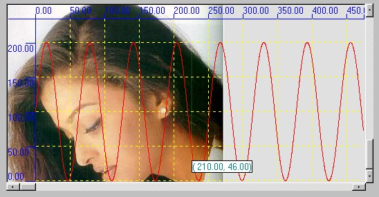

<div align="center">

## Ashu Graph Control


</div>

### Description

I tried for a excellent graph activex control but doesn't found and surprised, why no one neeed

plotting graph, i found it is useful in many cases to show your data graphically , so i submit it;; go with my latest version of it at ...

http://www.planet-source-code.com/vb/scripts/ShowCode.asp?txtCodeId=36451&lngWId=1
 
### More Info
 
BackColor : backcolor of graph control

Font : font in which scales(horizontal & vetical) will be dispalyed

Forecolor : decides the colors of scales (horizontal & vertical)

GridColor: decides the color of grids if ShowGrids prperty is true

TooltipBkColor : used to track & display data points(X,Y) as tooltip when mouse moves over graph and TrackMousePointer property is true

ToolTipForeColor : same as above

TrackMousePointer : whether track points when mouse move, i.e. when mouse move datapoints (x,y) should be displayed at location of mouse pointer

can be changed in run time

XGap ,YGap : in user units, the interval on scales(horizontal & vertical) at which values are marked

XMinPosition ,YMinPosition:in user units, Minimum position of scales , should not negative, usually 0.00

XUnitToPixel, YUnitToPixels: how to map user units to pixels, i.e., 1 user unit in X direction = ? pixels

for example, user can map 1 meter/second to 2 pixels , if speed is in vertical direction , by setting m_YUnitToPixels = 2

XScaleHeight ,YScaleWidth: user can change the scales ' width , depening upon font & font sizes he uses for scales

vb6, picturebox, scrollbar , some api functions

expalantions:

AshuGraph Control

Plot more than one Graphs , Can Print them, you can customize the colors of graph and scales

u can scroll graph , can track mouse points, can draw gridlines. please don't give try with negative value

or a positive value with greather than 32767.

An excellent graph control with its limitations. user draw graph in own units (whatever it may)

How to use :

Initalization:

1. Set Simple Properties in design mode

BackColor : backcolor of graph control

Font : font in which scales(horizontal & vetical) will be dispalyed

Forecolor : decides the colors of scales (horizontal & vertical)

GridColor: decides the color of grids if ShowGrids prperty is true

TooltipBkColor : used to track & display data points(X,Y) as tooltip when mouse moves over graph and TrackMousePointer property is true

ToolTipForeColor : same as above

TrackMousePointer : whether track points when mouse move, i.e. when mouse move datapoints (x,y) should be displayed at location of mouse pointer

can be changed in run time

XGap ,YGap : in user units, the interval on scales(horizontal & vertical) at which values are marked

XMinPosition ,YMinPosition:in user units, Minimum position of scales , should not negative, usually 0.00

XUnitToPixel, YUnitToPixels: how to map user units to pixels, i.e., 1 user unit in X direction = ? pixels

for example, user can map 1 meter/second to 2 pixels , if speed is in vertical direction , by setting m_YUnitToPixels = 2

XScaleHeight ,YScaleWidth: user can change the scales ' width , depening upon font & font sizes he uses for scales

2. Initialization at run time

NOTE:

Presently maximum limit on No of Graphs you can draw in control is 5 and you can change it by

changing the value of constant MAX_NO_OF_GRAPHS in source code

InitializeMe : whenever your program strats or when you want to remove all graphs from control, if you are removing graphs , then

after calling it, call invalidate()

Functions:

Invalidate(): always call, when u make any cahnges in graphs , i.e. adding a point to graph, deleting a graph, changing a point of graph

it refreshes graph control with new values

SetColor( color in rgb, graph no) : display a graph ( graph no ) with specified color

Addpoint(x,y,graphNO) : add point x,y to graph no graphNo

GetData(x,y,index,graphNo): retrieve the data x,y from graph graphNo, at specific index ( index in which order you added the data)

if success return true

SetData(x,y,index,graphNo): change the data x,y at specific index in graph graphNo ; cannot be used to add data to graph

(Index - in which order you added data to this graph) if success return true

RemoveGraph(graphNo) : doesn't display graph , you can use this graphNo to add new graph to control, after using this call Invalidate

Printing:

PrintSetting(leftMargin in Pixels, top Margins in Pixels,Header for graph , label for x axis, label for y axis, variable to decide to print page no( 0 for don't print , 1 for print on top, 2 for print on bottom),zoom factor for zooming printing of graph ( in percentage, for simple printing value should be 100),PaperSize = 9 for A4 size ; = 10 for A4 small size; = 1 for letter size ; = 8 for A3 size; = 11 for a5 size(for more see help on "printer" object in vb editor, print quality = -1 for draft printting and = - 4 for high resolution)

PrintMe() : to print graph from your default printer


<span>             |<span>
---                |---
**Submitted On**   |2002-06-25 10:28:52
**By**             |[Ashutosh Upadhyay](https://github.com/Planet-Source-Code/PSCIndex/blob/master/ByAuthor/ashutosh-upadhyay.md)
**Level**          |Intermediate
**User Rating**    |4.8 (24 globes from 5 users)
**Compatibility**  |VB 6\.0
**Category**       |[OLE/ COM/ DCOM/ Active\-X](https://github.com/Planet-Source-Code/PSCIndex/blob/master/ByCategory/ole-com-dcom-active-x__1-29.md)
**World**          |[Visual Basic](https://github.com/Planet-Source-Code/PSCIndex/blob/master/ByWorld/visual-basic.md)
**Archive File**   |[Ashu\_Graph984276252002\.zip](https://github.com/Planet-Source-Code/ashutosh-upadhyay-ashu-graph-control__1-36239/archive/master.zip)

### API Declarations

```
Public Declare Function SelectObject Lib "gdi32" (ByVal hdc As Long, ByVal hObject As Long) As Long
Public Declare Function MulDiv Lib "kernel32" (ByVal nNumber As Long, ByVal nNumerator As Long, ByVal nDenominator As Long) As Long
Public Declare Function GetDeviceCaps Lib "gdi32" (ByVal hdc As Long, ByVal nIndex As Long) As Long
Public Declare Function DeleteObject Lib "gdi32" (ByVal hObject As Long) As Long
Public Declare Function TextOut Lib "gdi32" Alias "TextOutA" (ByVal hdc As Long, ByVal X As Long, ByVal Y As Long, ByVal lpString As String, ByVal nCount As Long) As Long
Long, ByVal F As String) As Long
Public Declare Function SetPixelV Lib "gdi32" (ByVal hdc As Long, ByVal X As Long, ByVal Y As Long, ByVal crColor As Long) As Long
Public Declare Function GetPixel Lib "gdi32" (ByVal hdc As Long, ByVal X As Long, ByVal Y As Long) As Long
Public Declare Function LineTo Lib "gdi32" (ByVal hdc As Long, ByVal X As Long, ByVal Y As Long) As Long
Public Declare Function MoveToEx Lib "gdi32" (ByVal hdc As Long, ByVal X As Long, ByVal Y As Long, lpPoint As POINTAPI) As Long
Public Declare Function SetTextColor Lib "gdi32" (ByVal hdc As Long, ByVal crColor As Long) As Long
Public Declare Function AbortDoc Lib "gdi32" (ByVal hdc As Long) As Long
Public Declare Function Escape Lib "gdi32" (ByVal hdc As Long, ByVal nEscape As Long, ByVal nCount As Long, lpInData As Any, lpOutData As Any) As Long
Public Declare Function CreateCompatibleDC Lib "gdi32" (ByVal hdc As Long) As Long
Public Declare Function StretchBlt Lib "gdi32" (ByVal hdc As Long, ByVal X As Long, ByVal Y As Long, ByVal nWidth As Long, ByVal nHeight As Long, ByVal hSrcDC As Long, ByVal xSrc As Long, ByVal ySrc As Long, ByVal nSrcWidth As Long, ByVal nSrcHeight As Long, ByVal dwRop As Long) As Long
Public Declare Function DeleteDC Lib "gdi32" (ByVal hdc As Long) As Long
Public Type OrientStructure
 Orientation As Long
 Pad As String * 16
End Type
Public Type Size
 cx As Long
 cy As Long
End Type
Public Const MAX_PATH = 260
Public Type POINTAPI
 X As Long
 Y As Long
End Type
 Public Type RECT
 Left As Long
 Top As Long
 Right As Long
 Bottom As Long
End Type
Public Type RECTL
 Left As Long
 Top As Long
 Right As Long
 Bottom As Long
End Type
```


